<h1 style="text-align:center">Logo Generation with Diffusion Models</h1>

Y.Benjelloun, A.Bruez, N.Chek, H.Talaoubrid

 
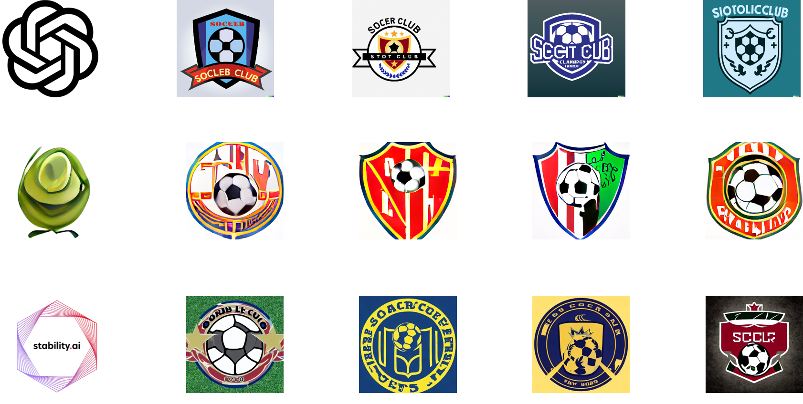</img>
 

## Table of contents
- [Motivation](#motivation)
- [Diffusion models](#diffusion-models)
- [Theory : finetuning DALL-E 2](#theory--finetuning-dall-e-2)
- [Collecting data](#collecting-data)
- [Training CLIP](#training-clip)
- [Results](#results)
- [Introspection](#introspection)

## Motivation 

Creating logos for both commercial and artistic purposes is a complex task, **historically assigned to humans**. We are seeing these on a daily-basis : in the streets, in public transports, in TV advertisement and in almost every man-made objects.

We then can easily notice some **usual patterns** in logo design (shape, color, text...) related to the activity the logo is supposed to stand for. 

As we are aware of how competitive new **Diffusion Models** are, we wondered if it was possible to use them for this purpose. 

This could help :

* Save **time**
* Save **money**
* Be **accessible** (no design competences required)

## Diffusion models

Diffusion models are **text-to-image Machine Learning models**. 

**We collected and tried few of them (locally)** in order to get more confident with the way they work. It enabled us to get used to their associated open-source projects. 

Their uses require some resources such as important GPU VRAM. Some of them can be ran on CPU but with lower performances and longer runtime.

The following elements illustrate what we have tested by ourselves.

* **Stable diffusion [using CompVis project](https://github.com/CompVis/stable-diffusion)** : 

This was trained on the [5B LAION dataset](https://laion.ai/blog/laion-5b/) made of 5B couples of image and linked caption.

We both tried it **on a regular CPU** (Intel Core I5 10th generation) and on our **16Gb VRAM [Tesla T4](https://www.nvidia.com/fr-fr/data-center/tesla-t4/) GPU**.

It takes **45 minutes** to run on CPU and **10 seconds** on the GPU we used. **270 times faster !**

| Text         | Image |
|--------------|:-----:|
| A bald guy skiing in a green plain |  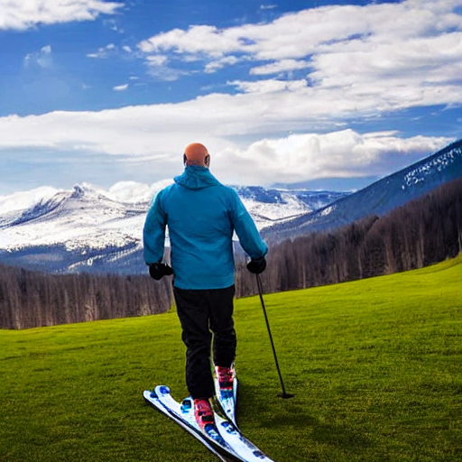</img> |
| A fireman saving a child from a burning castle |  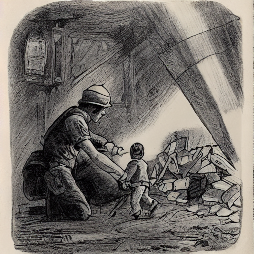</img> |
| A judo champion tanning on a beach |  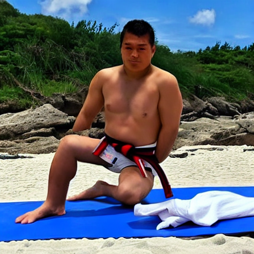</img> |
| A little smurf riding a dog |  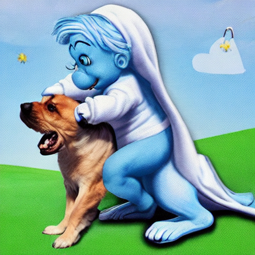</img> |

 

* **DALLE Mini [using this project](https://github.com/borisdayma/dalle-mini)** : 

The model developers used 3 datasets for the model:

* [Conceptual Captions Dataset](https://aclanthology.org/P18-1238/), which contains 3 million image and caption pairs.
* [Conceptual 12M](https://arxiv.org/abs/2102.08981), which contains 12 million image and caption pairs.
* The [OpenAI subset](https://github.com/openai/CLIP/blob/main/data/yfcc100m.md) of [YFCC100M](https://multimediacommons.wordpress.com/yfcc100m-core-dataset/), which contains about 15 million images and that we further sub-sampled to 2 million images due to limitations in storage space. They used both title and description as caption and removed html tags, new lines and extra spaces.

It took several minutes to get the output.

| Text         | Image |
|--------------|:-----:|
| Beautiful sunset on a lake |  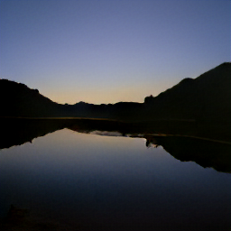</img> |
| The Eiffel tower on the night |  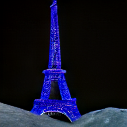</img> |

 

* **DALLE-2 [using this project](https://github.com/LAION-AI/dalle2-laion)** : 

This is not the official [OpenAI DALL-E 2](https://openai.com/dall-e-2/) version but a replica one trained on [LAION dataset](https://laion.ai/blog/laion-5b/).

It took several minutes to get the output.

| Text         | Image |
|--------------|:-----:|
| Beautiful corgi playing soccer |  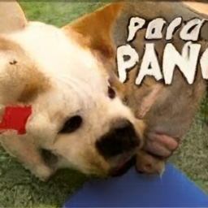</img> |

## Theory : finetuning DALL-E 2

As we can see down here, the output for `"A soccer club logo"` is quite good.

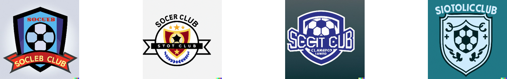

The output is indeed quite good but doesn't provide logos that can be immediately used for official purposes. We still have several issues mainly linked to text generation on logos.  

We then want to improve the model in order to better perform on logo generation. 

We decided to pay attention to [DALL-E 2 replica](https://github.com/LAION-AI/dalle2-laion) for our logo generation task.

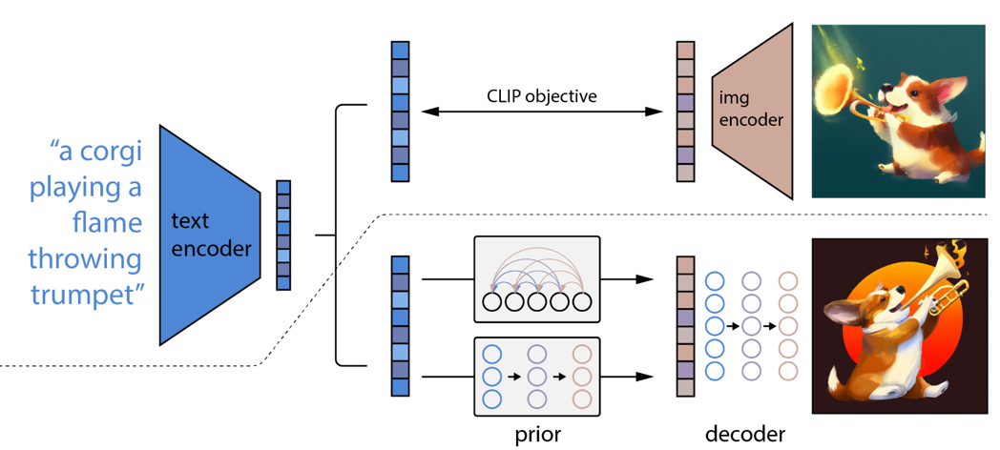

Without giving more details about how DALLE-2 works (you will find very precise stuff on [research papers](https://arxiv.org/pdf/2204.06125)), the architecture is made of **3 different models**.

* **CLIP** : 
* **Prior** :
* **Decoder** : 

The idea in this project is then to finetune these sub-models in order to improve the main one.

## Collecting data

We first need to collect data. More particularily, we need couples of logo and associated caption. In this project, we focused on sport club logos. 

* **sportslogohistory.com**

Finding this kind of dataset was not that easy. We luckily found a great website with sport team logos that were described by humans. These logos are free to use. 

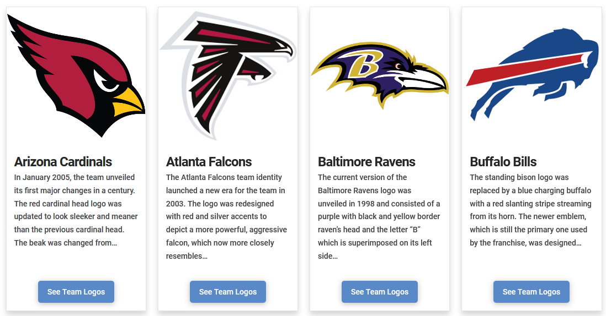

Lucily again, about 500 logos are available on the website. They are displayed in cards, above their description. 

As there is no API for this website, we developed an *ad-hoc* webscraping algorithm using Python and BeautifulSoup4. [The associated code](https://gitlab.mines-ales.fr/AntoineBrz/diffusion-model-for-logo-generation/-/tree/%23f-dataset-generator/) is available on another branch. 

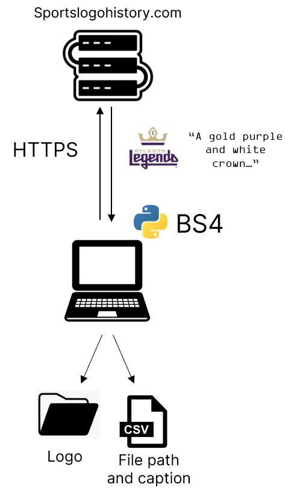

## Training CLIP

## Results

## Introspection