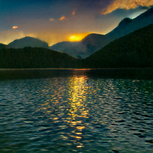

<h1 style="text-align:center">Logo Generation with Diffusion Models</h1>

Y.Benjelloun, A.Bruez, N.Chek, H.Talaoubrid

 
</img>
 

## Table of contents
- [Motivation](#motivation)
- [Diffusion models](#diffusion-models)
- [Theory : finetuning DALL-E 2](#theory--finetuning-dall-e-2)
- [Collecting data](#collecting-data)
- [Training CLIP](#training-clip)
- [Results](#results)
- [Introspection](#introspection)

## Motivation 

Creating logos for both commercial and artistic purposes is a complex task, historically assigned to humans. We are seeing these on a daily-basis : in the streets, in public transports, in TV advertisement and in almost every man-made objects.

We then can easily notice some usual patterns in logo design (shape, color, text...) related to the activity the logo is supposed to stand for. 

As we are aware of how competitive new **Diffusion Models** are, we wondered if it was possible to use them for this purpose. 

This could help :

* Save **time**
* Save **money**
* Be **accessible** (no design competences required)

## Diffusion models

Diffusion models are text-to-image Machine Learning models. 

We collected and tried few of them (locally) in order to get more confident with the way they work. It enabled us to get used to their associated open-source projects. 

Their uses require some resources such as important GPU VRAM. Some of them can be ran on CPU but with lower performances and longer runtime.

This is some of the results we get :

* **Stable diffusion [using CompVis project](https://github.com/CompVis/stable-diffusion)** : 

| Text         | Image |
|--------------|:-----:|
| A bald guy skiing in a green plain |  </img> |
| A fireman saving a child from a burning castle |  </img> |
| A judo champion tanning on a beach |  </img> |
| A little smurf riding a dog |  </img> |

 

* **DALLE Mini [using this project](https://github.com/borisdayma/dalle-mini)** : 

| Text         | Image |
|--------------|:-----:|
| Beautiful sunset on a lake |  </img> |
| The Eiffel tower on the night |  </img> |

 

* **DALLE-2 [using this project](https://github.com/LAION-AI/dalle2-laion)** : 

*This is not the official [OpenAI DALL-E 2](https://openai.com/dall-e-2/) version but a replica one trained on [LAION dataset](https://laion.ai/blog/laion-5b/).*

| Text         | Image |
|--------------|:-----:|
| Beautiful corgi playing soccer |  </img> |

## Theory : finetuning DALL-E 2

## Collecting data

## Training CLIP

## Results

## Introspection