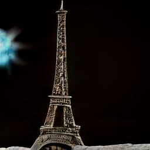

<h1 style="text-align:center">Logo Generation with Diffusion Models</h1>
<p style="text-align:center; font-size:15px">Y.Benjelloun, A.Bruez, N.Chek, H.Talaoubrid</p>
<a src="https://gitlab.mines-ales.fr/AntoineBrz/diffusion-model-for-logo-generation"><p style="text-align:center; font-size:15px" >https://gitlab.mines-ales.fr/AntoineBrz/diffusion-model-for-logo-generation</p></a>


| :zap:        Ignore at your own risk!   |
|-----------------------------------------|

Many associated resources are located on our Gitlab repository !

<br>

</img>
<br>

## Table of contents
- [Motivation](#motivation)
- [Diffusion models](#diffusion-models)
- [Theory : finetuning DALL-E 2](#theory--finetuning-dall-e-2)
- [Collecting data](#collecting-data)
- [Submodels finetuning](#sub-models-finetuning)
- [Results](#results)
- [Introspection](#introspection)

## Motivation 

Creating logos for both commercial and artistic purposes is a complex task, **historically assigned to humans**. We are seeing these on a daily-basis : in the streets, in public transports, in TV advertisement and in almost every man-made objects.

We then can easily notice some **usual patterns** in logo design (shape, color, text...) related to the activity the logo is supposed to stand for. 

As we are aware of how competitive new **Diffusion Models** are, we wondered if it was possible to use them for this purpose. 

This could help :

* Save **time**
* Save **money**
* Be **accessible** (no design competences required)

## Diffusion models

Diffusion models are **text-to-image Machine Learning models**. 

**We collected and tried few of them (locally)** in order to get more confident with the way they work. It enabled us to get used to their associated open-source projects. 

**Their uses require some resources such as important GPU VRAM**. Some of them can be ran on CPU but with lower performances and longer runtime.

The following elements illustrate what we have tested by ourselves.

* **Stable diffusion [using CompVis project](https://github.com/CompVis/stable-diffusion)** : 

This was trained on the [5B LAION dataset](https://laion.ai/blog/laion-5b/) made of 5B couples of image and linked caption.

We both tried it **on a regular CPU** (Intel Core I5 10th generation) and on our **16Gb VRAM [Tesla T4](https://www.nvidia.com/fr-fr/data-center/tesla-t4/) GPU**.

It takes **45 minutes** to run on CPU and **10 seconds** on the GPU we used. **270 times faster !**

| Text         | Image |
|--------------|:-----:|
| A bald guy skiing in a green plain |  </img> |
| A fireman saving a child from a burning castle |  </img> |
| A judo champion tanning on a beach |  </img> |
| A little smurf riding a dog |  </img> |

<br>

* **DALLE Mini [using this project](https://github.com/borisdayma/dalle-mini)** : 

The model developers used 3 datasets for the model:

* [Conceptual Captions Dataset](https://aclanthology.org/P18-1238/), which contains 3 million image and caption pairs.
* [Conceptual 12M](https://arxiv.org/abs/2102.08981), which contains 12 million image and caption pairs.
* The [OpenAI subset](https://github.com/openai/CLIP/blob/main/data/yfcc100m.md) of [YFCC100M](https://multimediacommons.wordpress.com/yfcc100m-core-dataset/), which contains about 15 million images and that we further sub-sampled to 2 million images due to limitations in storage space. They used both title and description as caption and removed html tags, new lines and extra spaces.

It took several minutes to get the output.

| Text         | Image |
|--------------|:-----:|
| Beautiful sunset on a lake |  </img> |
| The Eiffel tower on the night |  </img> |

<br>

* **DALLE-2 [using this project](https://github.com/LAION-AI/dalle2-laion)** : 

This is not the official [OpenAI DALL-E 2](https://openai.com/dall-e-2/) version but a replica one trained on [LAION dataset](https://laion.ai/blog/laion-5b/).

It took several minutes to get the output.

| Text         | Image |
|--------------|:-----:|
| Beautiful corgi playing soccer |  </img> |

## Theory : finetuning DALL-E 2


As we can see down here, the output for `"A soccer club logo"` is quite good.


The output is indeed relevant but doesn't provide logos that can be immediately used for official purposes. We still have several issues mainly linked to text generation on logos.  

We then want to improve the model in order to better perform on logo generation. 

We decided to pay attention to [DALL-E 2 replica](https://github.com/LAION-AI/dalle2-laion) for our logo generation task.


Without giving more details about how DALLE-2 works (you will find very precise stuff on [research papers](https://arxiv.org/pdf/2204.06125)), the architecture is made of **3 different models**.

* **CLIP** : 
CLIP is a thechnique used to relate images and text to each other.
It allows the model to map images and text to a common space, where they can be compared and related to each other based on their similarity. It is trained on a large dataset of images and their corresponding captions. This allows the model to learn the relationship between images and text. When it is done, given an input image and an input text, such as a caption, the model is able to map the input image and text to a common space, where the distance between points represents the similarity between the corresponding image and text. Then it compares the position of the input image and text in the common space, and outputs a measure of their similarity. 
Overall, the CLIP is a useful technique for relating images and text to each other. It allows the model to compare and relate images and text based on their similarity, making it useful for tasks such as image search, caption generation or in our case image generation

* **Prior** :
Then the diffusion prior maps from the CLIP text encoding to a corresponding CLIP image encoding. It is also trained on a large dataset of images with their caption.

* **Decoder** : 
Finally, when we have this CLIP image encoding, we need to decode it and so generate the image. That is what Decoder do using diffusion i.e. it starts from a token generated by the priore model and will start from a noisy image and denoise it until having the final image.

The idea in this project is then to finetune these sub-models in order to improve the main one.

## Collecting data

We first need to collect data. More particularily, **we need couples of logo and associated caption**. In this project, we focused on **sport club logos**. 

* **sportslogohistory.com**

Finding this kind of dataset was not that easy. We luckily found a great website with sport team logos that were described by humans. These logos are free to use. 


Luckily again, about **500 logos** are available on the website. They are displayed in cards, above their description. 

As there is no API for this website, **we developed an *ad-hoc* webscraping script** using Python and BeautifulSoup4. [The associated code](https://gitlab.mines-ales.fr/AntoineBrz/diffusion-model-for-logo-generation/-/tree/%23f-dataset-generator/) is available on another branch (#f-dataset-generator).  


* **Data augmentation with GPT-2**

We tried to use [GPT-2](https://huggingface.co/nlpconnect/vit-gpt2-image-captioning) image-to-text model by OpenAI in order to **automatically caption other logos** found on the Internet. **We collected and used this model** locally, and made it run on our GPU setup.   

Unfortunately, **outputs were not specific enough**.

For instance we had : 

* `A blue lion drawing.`
* `A circle-shaped diagram.`
* `A Football ball.`


## Sub-models finetuning

As we said [previously](#theory--finetuning-dall-e-2), finetuning DALL-E 2 **implies finetuning its sub-models** (CLIP, Decoder, Prior). 

**Our first strategy** could be summed-up like this :


<br>

* **Finetuning CLIP**

CLIP models (many of them exist) are quite large models (minimum 5 GB) trained on large datasets (such as LAION). Training them from scratch is extremely demanding as it requires large data and big computing resources.

Thanks to dedicated open-source projects, **training this model was made possible**. 

We used **[open_clip project by mlfoundations](https://github.com/mlfoundations/open_clip)**. It enabled us **to run training scripts** quite easily (with many adaptations by the way).

It took our dataset as input (a `.tar` file containing logos (`.png`) and caption (`.txt`)).


```python
python -m training.main \
    --save-frequency 1 \
    --zeroshot-frequency 1 \
    --report-to tensorboard \ # Logs metrics on tensorboard (GUI accessible on open port)
    --train-data="clip_dataset.csv"  \ # CSV file with logo and caption filepaths - training
    --val-data="clip_dataset_val.csv" \ # CSV file with logo and caption filepaths - validation 
    --csv-img-key filepath \ # CSV column name for logo filepath
    --csv-caption-key title \ # CSV column name for caption filepath
    --warmup 10 \
    --batch-size=128 \
    --lr=1e-3 \ # Learning rate
    --wd=0.1 \
    --epochs=30 \ # Number of epochs
    --workers=0 \ # Number of workers
    --model RN50 \ # Model selection - here RN50
```

Running the following program will output some metrics that can saved an plot. Most important, our learning curve.


*You can find the [output file](https://gitlab.mines-ales.fr/AntoineBrz/diffusion-model-for-logo-generation/-/blob/%23f-model-training/out.log) on our related repository*

What we have seen here is the process to train CLIP from scratch. 

If we had time enough to dig deeper, we would have finetuned this model using some options provided below.

```python
python -m training.main \
    --train-data="/path/to/train_data.csv" \
    --val-data="/path/to/validation_data.csv"  \
    --resume /path/to/checkpoints/epoch_K.pt
```

* **Finetuning Decoder**

We spent many time (days) working on this subject. As usual, we used a great open source project called **[DALLE-2-pytorch](https://github.com/lucidrains/DALLE2-pytorch)**.

Providing your own config file, you can finetune DALL-E 2 decoder using your own CLIP (required to train the Decoder). As an example, we provide [our config file](https://gitlab.mines-ales.fr/AntoineBrz/diffusion-model-for-logo-generation/-/blob/%23f-model-training/train_decoder_config.json). It uses [a decoder from HuggingFace repository](https://huggingface.co/nousr/dalle2-pytorch).

Unfortunately, we ran out of time and we still suffer from bugs and issues. Still motivated, we won't give up and try again.

## Results

We can then export the trained models as regular `.pth` file and use it in DALL-E 2 architecture, using the **[DALL-E-2-pytorch project](https://github.com/lucidrains/DALLE2-pytorch)**. You can edit given [config files](https://github.com/lucidrains/DALLE2-pytorch/tree/main/configs) (can be tricky) and **use your own CLIP and decoder** instead of official ones. 

In a theoretical world where all of this would work, we would need to evaluate our accuracy / performance on generating logos. 

* We would have **two options** to do so :


Ask human to tell what is the more relevant logo among regular DM generation and our finetuned DM. We could then get statistics.

<br>


Use CLIP (not our) to evaluate the likelihood between our generation and the input text.

## Introspection


In a nutshell we think that :

- [x] We have not enough augment our dataset
- [x] We suffered from an obvious lack of time due to a over-ambitious objectives targetting
- [x] We learnt a lot of things on SOTA subjects
- [x] We get more confident with Pytorch
- [x] We get more confident with using GPU resources on remote (cloud) computing
- [x] We are disapointed not to be able to show you more functional things.